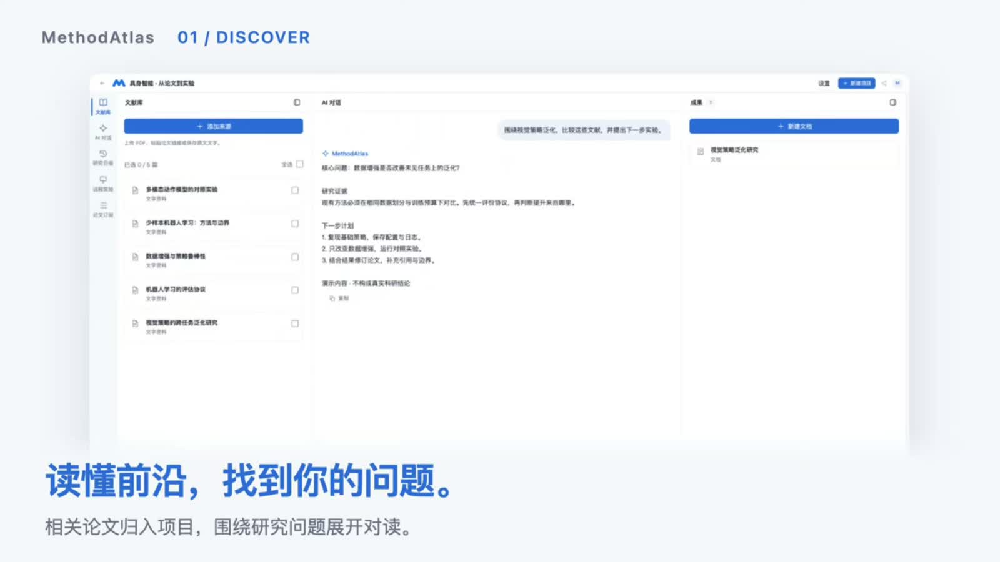

<p align="center"></p>

# MethodAtlas · 个人研究工作台

**把文献阅读、研究对话和成果产出连成一个可追溯的工作流程。**

围绕研究主题收集论文，在原文旁持续提问、比较方法，把有依据的结论整理成文稿、图表和汇报。研究保留所用资料的版本；点击引用，可以回到对应原文。

[在线体验](https://methodatlas.64-90-4-239.sslip.io/) · [观看演示](docs/assets/methodatlas-demo.mp4) · [本地安装](docs/installation.md) · [使用说明](docs/usage.md) · [体验案例](docs/example.md)

在线工作台设有登录入口，访问凭据由项目方单独提供。本地运行使用自己的模型连接。



## 从资料到成果

| 环节 | 可以做什么 |
| --- | --- |
| 文献阅读 | 导入 PDF、论文链接或文字，阅读正文、原 PDF 与图表。 |
| 研究对话 | 围绕资料追问、比较方法，通过引用核对回答的依据。 |
| 成果产出 | 生成综述、方法对比和关系图谱；编辑论文，审阅并接受 AI 修改提案。 |
| 保存与交付 | 保留成果版本，按类型导出 HTML、Markdown、PDF、DOCX 或 PPTX。 |

工作台还提供个人研究方法、论文订阅、研究记录，以及需另外配置服务器的远程实验入口。详见[使用说明](docs/usage.md)。

## 产品演示

[**播放完整演示视频 · 4 分 31 秒 · 1080p**](docs/assets/methodatlas-demo.mp4)

视频展示产品操作。若 GitHub 不提供内嵌播放，可在视频文件页下载后播放。

## 本地运行

需要 Python 3.12、Node.js ≥ 22.18，以及自己的模型连接。macOS / Linux：

```sh
git clone https://github.com/zcx28/MethodAtlas-showcase.git
cd MethodAtlas-showcase
python3.12 -m venv .venv
.venv/bin/python -m pip install -r requirements.txt
npm ci
npm run build:writing
.venv/bin/python -m backend.app
```

打开终端打印的地址，在「设置 → 模型连接」添加并测试自己的连接。论文检索还需独立搜索环境；完整步骤、Windows 命令及可选组件见[安装说明](docs/installation.md)。

## 先试这条流程

1. 新建项目，导入两至三篇同一主题的论文。
2. 勾选资料：“比较这些方法的输入、核心设计和适用条件，请给出原文依据。”
3. 点击引用，核对对应段落或原页。
4. 要求生成比较报告，在右侧预览、修订并导出。

[机器人模仿学习案例](docs/example.md)提供论文入口和提问顺序。

## 源码结构

```text
backend/          本地服务、研究 Agent、资料与成果版本管理
prototype/        实际运行的前端、编辑器和静态资源
third_party/      产品使用的第三方模块、模板与许可证
docs/             安装说明、使用说明和最终演示素材
```

`check` 脚本用于功能回归，见[检查说明](docs/checks.md)。模型回答需要结合原文判断；论文下载取决于来源可用性和访问权限。第三方来源见[依赖说明](docs/dependencies.md)。
